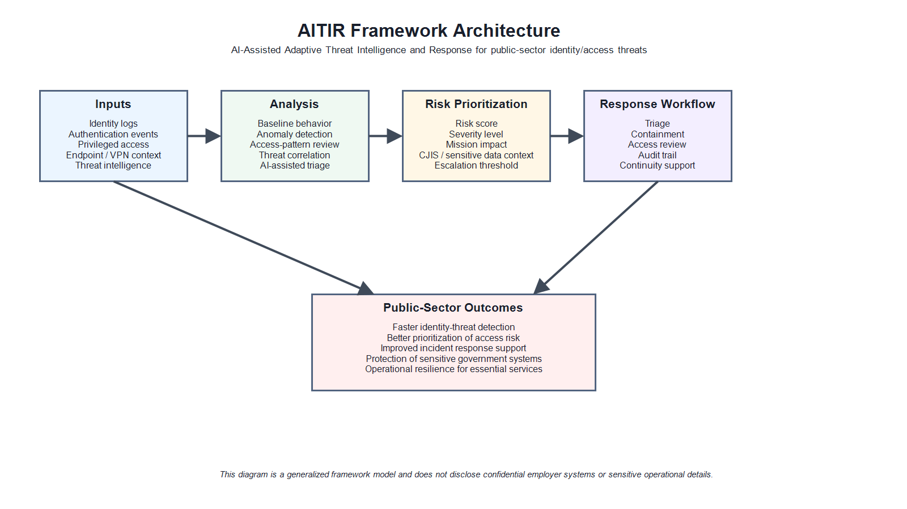

# AITIR Framework

**AI-Assisted Adaptive Threat Intelligence and Response for identity-centered public-sector cybersecurity**

AITIR is an early-stage cybersecurity framework developed by Md Sazzad Hossain to support identity-centered threat detection, access-risk prioritization, and response planning in public-sector and law-enforcement technology environments.

The framework focuses on a practical problem: government systems rely on identity, access, authentication, remote connectivity, endpoint protection, audit trails, and operational continuity at the same time. Traditional access reviews and static control checks remain important, but they do not always help teams prioritize adaptive identity-based threats quickly enough for operational response.

AITIR is intended to connect identity and access activity with threat intelligence, contextual risk scoring, and response workflow guidance.

## Documentation

- [Technical Overview](docs/technical-overview.md)
- [Framework Architecture](docs/architecture.md)
- [Public-Sector Use Cases](docs/use-cases.md)
- [NIST RMF and Control Alignment](docs/nist-rmf-alignment.md)
- [Proof-of-Concept Demonstration](docs/proof-of-concept.md)
- [Sample Risk Scoring Model](docs/sample-risk-scoring-model.md)
- [Pilot Evaluation Protocol](docs/pilot-evaluation-protocol.md)
- [Development Roadmap](docs/roadmap.md)
- [Research and Publications](docs/research-and-publications.md)
- [Status and Limitations](docs/status-and-limitations.md)

## Intended Users

AITIR is designed for cybersecurity professionals, public-sector technology teams, law-enforcement IT environments, academic reviewers, and practitioners interested in identity-centered threat detection and adaptive response planning.

## Scope

AITIR is currently a framework and documentation project. It is not presented as a fully deployed commercial product, certified security tool, or employer-sponsored system. The documentation is public-facing and avoids confidential employer information, sensitive infrastructure details, controlled technical information, or operational security data.

The repository also includes a synthetic proof-of-concept package. The sample data and scoring examples are illustrative only; they do not contain real agency records, real user activity, employer data, or operational security information.

## Core Concepts

- Identity and access behavior can be treated as a major source of threat intelligence.
- Risk scoring should account for user role, access context, system sensitivity, event type, timing, and response urgency.
- Public-sector environments need explainable and auditable response recommendations.
- The framework should support secure digital government services, law-enforcement technology environments, and public-sector infrastructure where identity misuse can create public safety, privacy, continuity, or service-delivery risk.

## Citation

If referencing this framework, please cite:

> Hossain, M. S. (2026). AITIR Framework: AI-Assisted Adaptive Threat Intelligence and Response for Identity-Centered Public-Sector Cybersecurity. Public framework documentation.

## Author

Md Sazzad Hossain  
System Analyst | Cybersecurity and Public-Sector Technology  
Research areas: cybersecurity, artificial intelligence, identity and access security, public-sector cyber resilience, post-quantum cryptography, graph neural networks, and fraud detection.
